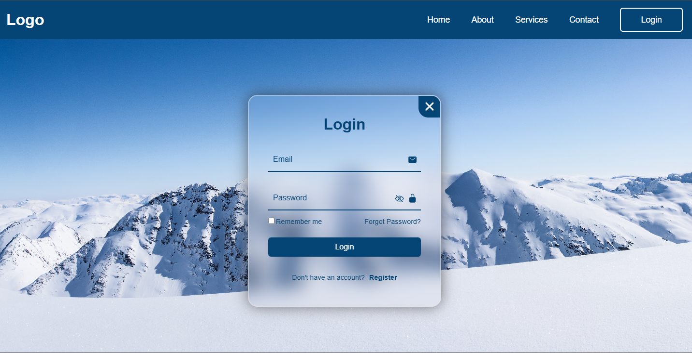
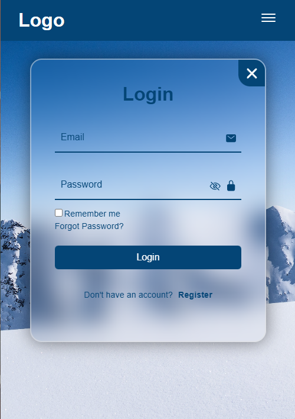
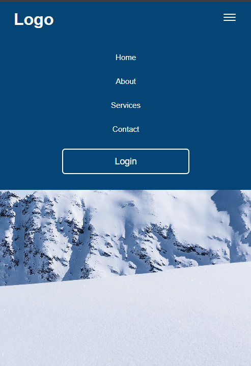

# Login and Register UI

Responsive login and registration interface built with HTML, CSS and JavaScript.

This project focuses on clean UI, smooth UX and proper behavior across desktop and mobile devices.

---

## 📌 Features

- Login and registration modal
- Toggle between login and register forms
- Password visibility toggle with dynamic icon
- Responsive layout (desktop, tablet and mobile)
- Mobile hamburger navigation menu
- Form reset on screen change
- Clean and organized code structure

---

## 🛠️ Technologies

- HTML5
- CSS3 (Flexbox, Media Queries)
- Vanilla JavaScript
- Ionicons

---

## 🚀 How to Run

1. Clone the repository:
   ```bash
   git clone https://github.com/SEU_USUARIO/Login_and_Register.git
   ```

2. Open `index.html` in your browser.


> No build tools or dependencies required. 

---

## 🎯 Purpose
This project was created to practice:

- Responsive layouts
- UI/UX behavior
- DOM manipulation
- Modal interactions
- Clean JavaScript structure

## 📷 Preview

### Desktop


### Mobile


### Mobile Navigation



## Author

**Pedro Monteiro**
Fullstack Developer

- GitHub: https://github.com/PedroMJK
- LinkedIn: https://www.linkedin.com/in/pedro-monteiro-3173b8241/


